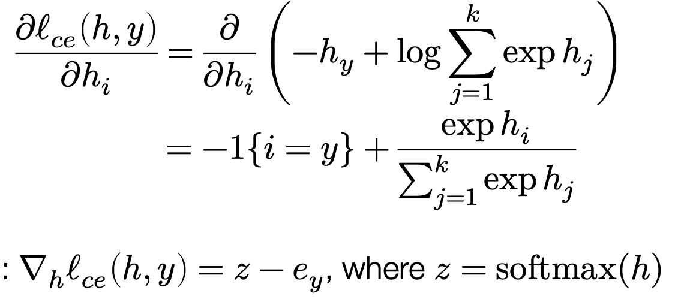

# Notes

# Lec 1 2: Foundation of ML

推Softmax Loss

- Softmax: exp(Zi) / sum{exp(Zi)}
- Cross Entropy Loss: sum{- yi * log(pi) } = - 1 * log(pi) where i is the true index.
- Softmax Loss: - 1 * log(exp(Zi) / sum{exp(Zi)}) = log(sum{exp(Zi)}) - Zi where i is the true index.
- Gradient of Softmax Loss:
    - Minimize Loss
    - Scala:
        
        
        
    - Matrix 形式: 假装是scalar，凑矩阵形状
    - X is input, Z is softmax(X), I is indicator function.
    - z: (B, k)  x: (B, n) theta: (n, k) Loss: (n, k)
    - z = softmax(x * theta) = (B, k)  x: (B, n)  theta: (n, k)
    - Loss should match theta: (n, k), So x^T * z!
        
        
        

# Lec 3: Manual NN

非线性层

- Softmax 的微分是 S - I_y

**手推多层MLP BP：**


- sigma 是非线性层
- Wi是参数，Zi是正向的输出，Gi是用于反向传播的参数

**HW0: 二层MLP**

- h(x) = Softmax(W2.T * ReLU(W1.T * x)) : x 是向量
- 当有一个batch时: x^i是向量
    
    
    
- 写成矩阵：h(X) = ReLU(X at W1) at W2：X是矩阵
- **有问题：需要看看到底是PPT错了还是我错了**
    - **我错了，但是根据PPT这个多层公式推由于Softmax求导困难比较难计算**
    - Forward
        - Z1 = X
        - Z2 = ReLU(Z1 at W1)
        - Z3 = Soft(Z2 at W2)
    - Backward
        - G3 = Z3 - Iy
            - Soft’ Z = 有点难推其实，所以应该将其与交叉熵融合一起推导
            
            
            
        - G2 = (G3 * Relu’(Z1 at W1)) at W1.T
            - Relu’ Z = 1(Z > 0)
            - G2 = (G3 * (Z1 at W1 > 0)) at W1.T
        - DeltaW1 = Z1.T (G2 * ReLU’(Z1 W1)) = X.T (G2 * Z2)
        - DeltaW2 = Z2.T (G3 * Soft’(Z2 W2)) = Z2.T (G3 * Z3)
- 参考答案
    
    
    
- 重新推一遍: Matching Size
    
    ```python
    # Forward
    # X: (m, n)
    # W1: (n, d)
    # W2: (d, k)
    Z1 = X @ W1: (m, d)
    A1 = relu(Z1): (m, d)
    Z2 = A1 @ W2: (m, k)
    A2 = softmax(Z2): (m, k)
    
    # Backward
    # dy/dZ2 = A2 - Iy !!!: (m, k)
    dy/dW2 = dy/dZ2 * dZ2/dW2: (d, k)
    			 = (A2 - Iy) * A1
    			 = A1 @ (A2 - Iy)
    
    dy/dW1 = dy/dZ2 * dZ2/dA1 * dA1/dZ1 * dZ1/dW1
    			 = (A2 - Iy) * (W2.T) * relu'(Z1) * X
    #			 (m, k) (d, k) (m, d) (m, n) -> (n, d)
    #       n m @ (m k @ k d * d m) 不是这凑得也太离谱了
           = X.T @ ((A2 - Iy) @ W2.T * relu'(Z1))
    relu'(Z) = (Z > 0)
    ```
    

# Lec 4 5: Automatic Differentiation

Methods

1. Numerical: 计算机模拟直接暴力算
2. Symbolic: 推导

计算图**前向**自动微分


- R^n → R^k 一般来说n >> k
- 需要n forward AD Passes

重点：**反向自动微分**


- 注意反向时是dy / dvi


- Multiple pathway
- for j in multiple outputs: **dy / dvi** = Sigma { **dy / dvj** * dvj / dvi }

### AD Algorithm


- 按拓扑排序遍历节点
- 在遇到新节点时，遍历所有outputs 节点来计算dy / dvi
- 还要遍历j in inputs节点，计算这一个节点对其的贡献，包括两种：多path、单path
    - 但实际上计算dj / di保存就可以，遍历到j会发现是不是单path
- 因此维护一个node_to_grad: 二维vector，保存每个节点的grad中间信息
    
    
    
- 会发现和原图稍微有点不太一样，相当于每个有多个outputs的节点会分裂为outputs个数，不过只是计算上这样，实际上可以合并？
    - 实际上是Backprop vs Reverse mode AD
    - 第一代是原地做
    - 第二代：pytorch啥的都是建新图，节点会更多
        1. 优化更方便
        2. 可以得到Grad of Grad，比如v2，建个新节点会很方便，不然得算好久？
- Matrix形式
    
    
    
    - 简单推导一下
- 如果中间信息不是矩阵？
    - 对于自定义层可以自定义Adjoint： 比如字典取值
    

# Lec 5: AD Framework HW框架介绍

Needle

[Google Colaboratory](https://colab.research.google.com/drive/1cmDQ4HC9QzAaSIotk4Q5w6l7rh1gv7Hf#scrollTo=p13Esykh90iu)

Data structure

1. Value
    
    ```python
    self.op = op
    self.inputs = inputs
    self.num_outputs = num_outputs
    self.cached_data = cached_data
    self.requires_grad = requires_grad
    ```
    
2. Op

realize_cached_date()

- 计算的函数
- 如果**lazy**就在访问date时调用compute
    - pytorch是**eager** mode，不lazy
    - pytorch TPU XLA就会lazy
- 递归inputs，计算op.compute()

### AD的实现

对于参数x：

- dL/dx = dL/df df/dx
- incoming backward gradient 就是dL/df, which is the input of gradient function.
- 例子：f(x, y) = x + y
    - x, y is R^n
    - df/dx = 1
    - dL/dx = dL/df * 1  which is the same as **out_grad**
    - So for x, y:
        
        ```python
        def gradient(self, out_grad: Tensor, node: Tensor):
        		return out_grad, out_grad
        ```
        
- 对于gradient函数，其输入out_grad形状和这个算子的输出是相同的，其输出分别和对应的算子输入是相同的。
- 我们可以通过假设是标量并匹配形状来推导向量形式（好粗暴）

算子列表：

- `PowerScalar`
    - f = x^a
    - df/dx = a * x^(a-1)
- `EWiseDiv`
    - f = a / b
    - all:(m, n)
    - df/da = 1/b  df/db = -a/b^2
- `DivScalar`
    - f = x / a
    - df/dx = 1/a
- `MatMul`
    - f = a @ b
    - m, n = m, k x k, n
    - grad_a: (m, k) → (m, n) (n, k) = out_grad at bT
    - grad_b: (k, n) → (k, m) (m, n) = aT at out_grad
    - **错误**！注意不止二维，需要考虑多维情况！
        
        多维相当于a, b相乘的之后最后两维，然后前面的维度会broad_cast
        
        所以条件是：1. 最后两维可以乘 2. 前面的维度可以broadcast
        
        ```python
        c = a @ b
        a.shape, b.shape, c.shape
        ((6, 6, 5, 4), (1, 4, 3), (6, 6, 5, 3))
        c @ b.T = (6,6,5,3)@(1,3,4) = (6,6,5,4) ->sum no
        a.T @ c = (6,6,4,5)@(6,6,5,3) = (6,6,4,3) ->sum (1,4,3)
        ---
        def gradient(self, out_grad, node):
                ### BEGIN YOUR SOLUTION
                a, b = node.inputs
                grad_a = matmul(out_grad, transpose(b))
                grad_b = matmul(transpose(a), out_grad)
                if grad_a.shape != a:
                    grad_a = grad_a.sum(axes=tuple(list(range(len(grad_a.shape) - len(a.shape)))))
                if grad_b.shape != b:
                    grad_b = grad_b.sum(axes=tuple(list(range(len(grad_b.shape) - len(b.shape)))))
                return grad_a, grad_b
                ### END YOUR SOLUTION
        ```
        
    - gradient: 实现时认为输出的矩阵前置没有无用的1？
    - TODO: 之后用needle和np对比一下
- `Summation`
    - 平均分合并的维度?
    - node - Sum - output
    - node.shape → out_grad.shape
    - (3, 2, 4) → axis = [1] → (3, 4)
    - out_grad → broad_cast → split_average
    - (3, 4) → (3, 2, 4) → (3, 2, 4)
    - 不会
    - 答案：
        - 直接broad_cast到原来形状，不用average
        - f = x.sum(axis=…)
        - in_shape → out_shape
        - (3, 2, 4) → (3, 4)  axis = [1]
        - out_grad: (3, 4),
            - First reshape to (3, 1, 4)
            - Then broad_cast_shape is (3, 2, 4)
- `BroadcastTo`
    - sum 扩充的维度
    - **广播的规则！**
        - ori_shape → out_shape
        - 尾端对齐，从后往前遍历，如果维度相同或者ori_shape[i]是1，则适配。
- `Reshape`
    
    ```python
    def gradient(self, out_grad, node):
        ### BEGIN YOUR SOLUTION
        target_shape = [self.shape[i] for i in self.shape]
        return array_api.reshape(out_grad, newshape=target_shape)
        ### END YOUR SOLUTION
    ```
    
- `Negate`
    - -1
- `Transpose`
    - f = x.T, x[i, j] ↔ x[j, i]
    - gradient就是将out_grad重新转置回去
    

实现参数更新（优化器）时，需要注意以下写法：

```python
# Good, only use pure value in the right side
W1 = ndl.Tensor(W1.realize_cached_data() - lr * W1.grad.realize_cached_data())
W2 = ndl.Tensor(W2.realize_cached_data() - lr * W2.grad.realize_cached_data())
# Good, avoid a long chain of computes by detach
W1 = (W1 - lr * ndl.Tensor(W1.grad)).detach()
W2 = (W2 - lr * ndl.Tensor(W2.grad)).detach()
# Wrong
W1 -= lr * W1.grad
W2 -= lr * W2.grad
# 这样也可以
W1 -= lr * W1.grad.realize_cached_data()
W2 -= lr * W2.grad.realize_cached_data()
```

# Lec 6 **Fully connected networks, optimization, initialization**

MLP的数学表示：


优化器

1. 直接梯度下降
2. 牛顿法考虑二次
3. 考虑动量
    1. unbiasing: 动量怎么初始化的问题
        
        
        
    2. Nesterov Momentum
        
        
        
    3. **Adam: Adaptive Gradient Method**
        - Momentum, Adaptive Scale Estimation
        
        
        

参数初始化

- 初始化很重要：**weights often stay much closer to their initialization than  to the “final” point after optimization from different.**
- 不能全0
- 方差会影响
- 最好保持N(0, 1)
    - Kaiming
    
    
    

# Lec 7 **Neural Network Library Abstractions**

### **Adam 优化器**

1. **参数**：
    - α: 学习率
    - β1: 用于一阶矩估计的指数衰减率（通常设置为 0.9）
    - β2: 用于二阶矩估计的指数衰减率（通常设置为 0.999）
    - ε: 一个很小的数，用于防止除以零（通常设置为 1e-8）
2. **初始化**：
    - m0: 一阶矩估计的初始值，通常为 0
    - v0: 二阶矩估计的初始值，通常为 0
    - t: 时间步的初始值，通常为 0
3. **在每次迭代中**：
    - t = t + 1
    - mt = β1 * mt-1 + (1 - β1) * gt （更新一阶矩估计）
    - vt = β2 * vt-1 + (1 - β2) * gt^2 （更新二阶矩估计）
    - m̂t = mt / (1 - β1^t) （对一阶矩估计进行偏差校正）
    - v̂t = vt / (1 - β2^t) （对二阶矩估计进行偏差校正）
    - θt = θt-1 - α * m̂t / (sqrt(v̂t) + ε) （更新参数）
    
    其中，gt 表示在时间步 t 的梯度，θt 表示参数。
    

介绍ML框架的两种流派和组成部分

- Imperative automatic differentiation(动态图）
- Declarative computation graph

# Lec 8

Softmax 数值爆炸

- exp xi 指数爆炸，实践中每个值都减去max(x)

介绍了module的定义、paramater等

# Lec 9 Normalization and Regularization

### Initialization初始化

ReLU

- 方差初始化为2/n
- 直觉上由于左边都没了，方差会除以二


- 初始化很重要！
- 我们需要在层之间加Norm Layer来确保weight不会爆炸或消失

Layer Normalization


- 好处
    - 不依赖batch大小
    - 推理时和训练时完全一致

Batch Normalization


- 好处
    - 减少Internal Covariate Shift
    - 支持更高的学习率
    - 对初始化不敏感
    

### Regularization 正则化

- L2: Weight Decay
- Dropout
- L1

# Lec 9 Convolutional Networks

原理没啥说的，主要是实现


x: (B, H_in, W_in,  C_in)

z: (B, H_out, W_out, C_out)

W: (C_in, C_out, k, k) 通道到通道一一映射都有一个卷积核参数

If padding && stride==1: H, W in and out is the same

- Padding
- Stride
- Pooling
- Grouped Conv
    
    
    
- Dilations
    
    
    

实现:

对于普通的矩阵点乘：z = W at x,  (m, n) = (m, k) at (k, n) 

v_hat: (m, n)

**W_grad: v_hat at x^T**

**x_grad: W^T at v_hat** 

---

对于一维卷积,我们可以构造W_hat: z = conv(x, W) = W_at at x


偏微分：Adjoint of Conv

v_hat: dy/dz

x_grad: W_hat.T at v_hat 这个其实就是卷积啊


**x_grad = conv(v_hat, flip(W)) flip means reverse(W)（现在是一维卷积）**

W_hat_grad: v_hat at x.T?

No! 

z = conv(x, W) = X_hat at W like this:


**W_grad = X_hat.T at v_hat**

- 总结
    - 使用技巧将卷积变为矩阵乘法，来推导反向偏微分
    - 计算W的微分，将W放在右侧构造X_hat
        - 相当于img2col的矩阵乘法
    - 计算x的微分，将x放在右侧构造W_hat
        - 相当于flip卷积
    - 可以在底层进一步优化内存和并行计算

# HW 2

### Q1: 初始化实现

### Q2: 实现常用Module

Linear

y = X at AT + b

X: N, H_in   AT: H_in H_out  b: N, H_out

注意初始化用init直接新建内存

forward需要手动广播

LogSumExp

x = log(sum(exp(z - max z))) + maxz

dl / dz = dl / dx * dx / dz

dx / dz = d(maxz) / dz + 1/(sum(exp(z - max z))) * d sum * exp(z-maxz) * (1 - d max z)

= 1/sumexp* exp(z-maxz) 

这个sum 和 max， max是常数，不用管，不会影响梯度方向

sum不是单独求，是softmax整体一起得到的结论？

实现：

就是梯度比较玄学，然后形状需要一致

```bash

class LogSumExp(TensorOp):
    def __init__(self, axes: Optional[tuple] = None):
        self.axes = axes

    def compute(self, Z):
        ### BEGIN YOUR SOLUTION
        maxz = array_api.max(Z, axis=self.axes, keepdims=True)
        maxz_r = array_api.max(Z, axis=self.axes)
        x = array_api.sum(array_api.exp(Z - maxz), axis=self.axes)
        return array_api.log(x) + maxz_r
        ### END YOUR SOLUTION

    def gradient(self, out_grad, node):
        ### BEGIN YOUR SOLUTION
        Z = node.inputs[0]
        maxz = Z.realize_cached_data().max(axis=self.axes, keepdims=True)
        sumexp = summation(exp(Z - maxz), self.axes)
        grad_Z = out_grad / sumexp
        # Adjust shapes: Due to axis in sum
        expand_shape = list(Z.shape)
        axes = range(len(expand_shape)) if self.axes is None else self.axes
        for axis in axes:
            expand_shape[axis] = 1
        grad_Z = grad_Z.reshape(expand_shape).broadcast_to(Z.shape)
        return grad_Z * exp(Z - maxz)
        ### END YOUR SOLUTION
```

LogSoftMax

x = exp(Z - maxz) / sum_exp

LayerNorm1d

直接在第二维求平均、方差

注意手动广播

BatchNorm

在batch维度（第一维度）求平均、方差

在training时利用动量求moving mean

training时用当前的mean求forward，eval时才用moving

怎么backward有问题？

第二天早上：LogSoftMax还没实现完！

LogSoftMax


maxz = max(Z, axes)

Exp(Z-maxz) / Sum(Exp(Max(Z)))

gradient

∂(log-softmax(Z)_i) / ∂Z_j = softmax(Z)_i - (i == j)

这咋推得？？

## Lecture 14 Conv Implementation

Naive

```bash
def conv_naive(Z, weight):
    N, H, W, C_in = Z.shape
    K, _, _, C_out = weight.shape
    out = np.zeros((N, H - K + 1, W - K + 1, C_out))
    # H - (K - 1)
    for n in range(N):
        for c_in in range(C_in):
            for c_out in range(C_out):
                for y in range(H - K + 1):
                    for x in range(W - K + 1):
                        for i in range(K):
                            for j in range(K):
                                out[n, y, x, c_out] += weight[i, j, c_in, c_out] * Z[n, y+i, x+j, c_in]
```

Conv 1x1 Kernel

- When kernel is 1x1, Then we could just matmul it!

```
W1 : (1, 1, Cin, Cout)
Z : (N, H, W, Cin)
out2 = Z @ W1[0,0]
# (N H W Cin) @ (Cin Cout) -> (N H W Cout)
```

Conv using matmul

```python
def conv_matrix_mult(Z, weight):
    N, H, W, C_in = Z.shape
    K, _, _, C_out = weight.shape # K K C_in C_out
    out = np.zeros((N, H - K + 1, W - K + 1, C_out))
    for i in range(K):
        for j in range(K):
            out += Z[:, i: i + H - K + 1, j: j + H - K + 1,: ] @ weight[i, j]
            # From 1x1 Kernel!
            # Just add all 1x1 result with shifts
    return out
```

Tool: strides manipulation

```bash
print(A.strides)
# Note in numpy: they use bytes not the actual num of elements

from numpy.lib.stride_tricks import as_strided

B = as_strided(A, shape=(3,3,2,2), strides=np.array((12,2,6,1))*4)
# strides
# A[i * st[0] + j * st[1] + k * st[2] ...]
# Need to look at A 
# Need to arrange manually
Like A is (actually A.bytes as flattened
[[ 0.  1.  2.  3.  4.  5.]
 [ 6.  7.  8.  9. 10. 11.]
 [12. 13. 14. 15. 16. 17.]
 [18. 19. 20. 21. 22. 23.]
 [24. 25. 26. 27. 28. 29.]
 [30. 31. 32. 33. 34. 35.]]
Oh ! It depends on what matrix you want from B.
You could mamumulate B by different views!

C = np.ascontiguousarray(B)
# Then need to change the actual memory
# or the using of as_strides would just be an view!

# When we call reshape in numpy after as_strides, it is copied

```

Using im2col

```python
from numpy.lib.stride_tricks import as_strided

def conv_im2col(Z, weight):
    N, H, W, C_in = Z.shape
    K, _, _, C_out = weight.shape
    out = np.zeros((N, H - K + 1, W - K + 1, C_out))
    Ns, Hs, Ws, Cs = Z.strides
    inner_dim = K * K * C_in
    Z_till = as_strided(Z, 
		    shape=(N, H - K + 1, W - K + 1, K, K, C_in), 
        strides=(Ns, Hs, Ws, Hs, Ws, Cs)).reshape(-1, inner_dim) # This is magic! By experiments! 
    out = Z_till @ weight.reshape(-1, C_out)
    return out.reshape(N, H - K + 1, W - K + 1, C_out)
```

此处仍有reshape造成的内存重新分配，之后可以继续优化

## Lec 15 16 RNN实现略过

## Lec 17 18 Transformer Implememtation

Transformer Block:


X: (T, d_embed)

WQ, WK, WV : (d_embed, d)

Q, K, V: (T, d)  = X at WQ … 

Q at KT = (T, d) (d, T) = (T, T)

---

Z_attention =  softmax(Q KT / sqrt(d)) at V = (T, d)

Z1= LayerNorm(Attention(Z)+ Z)

Z_feedforward = ReLU(Z1W1)W2)

Z2 = LayerNorm(FeedForward(Z1) + Z)

One Batch Edition

Z: (T, d)

```python
def softmax(Z):
    Z = np.exp(Z - Z.max(axis=-1, keepdims=True))
    return Z / Z.sum(axis=-1, keepdims=True)
    
def self_attention(X, mask, W_KQV, W_out):
    K,Q,V = np.split(X@W_KQV, 3, axis=-1)
    attn = softmax(K@Q.T / np.sqrt(X.shape[-1]) + mask)
    return attn@V@W_out, attn
```

Minibatching

Z: (B or N, T, d)

```python
def softmax(Z):
    Z = np.exp(Z - Z.max(axis=-1, keepdims=True))
    return Z / Z.sum(axis=-1, keepdims=True)
    
def self_attention(X, mask, W_KQV, W_out):
    K,Q,V = np.split(X@W_KQV, 3, axis=-1)
    attn = softmax(K@Q.swapaxes(-1,-2) / np.sqrt(X.shape[-1]) + mask)
    return attn@V@W_out, attn
```

Just replace transpose to swap axes…

Multihead Attention

Head num: H

K: [K1 K2 … KH] 

Q…V…

Yi = softmax(Ki QiT / sqrt(d / H)) Vi

Y = [Y1 Y2 … YH] at Wout

```python
def multihead_attention(X, mask, heads, W_KQV, W_out):
    N,T,d = X.shape 
    K,Q,V = np.split(X@W_KQV, 3, axis=-1)
    K,Q,V = [a.reshape(N,T,heads,d//heads).swapaxes(1,2) for a in (K,Q,V)]
    attn = softmax(K@Q.swapaxes(-1,-2) / np.sqrt(d//heads) + mask)
    return (attn@V).swapaxes(1,2).reshape(N,T,d) @ W_out, attn
```

Transformer Block - All in One

```python
def multihead_attention(X, mask, heads, W_KQV, W_out):
    N,T,d = X.shape 
    K,Q,V = np.split(X@W_KQV, 3, axis=-1)
    K,Q,V = [a.reshape(N,T,heads,d//heads).swapaxes(1,2) for a in (K,Q,V)]
    attn = softmax(K@Q.swapaxes(-1,-2) / np.sqrt(d//heads) + mask)
    return (attn@V).swapaxes(1,2).reshape(N,T,d) @ W_out, attn

def layer_norm(Z, eps):
    return (Z - Z.mean(axis=-1, keepdims=True)) / np.sqrt(Z.var(axis=-1, keepdims=True) + eps)

def transformer(X, mask, heads, W_KQV, W_out, W_ff1, W_ff2, eps):
    Z = layer_norm(multihead_attention(X, mask, heads, W_KQV, W_out)[0] + X, eps)
    return layer_norm(Z + relu(Z@W_ff1)@W_ff2, eps)
```

## HW 3

## CPU Back

### Part1

- reshape
    - How to compute new strides?
        - 直接compact，就是prod
- permute
    - stride和shape一样，根据axes变换顺序即可
- broadcast
    - 对于扩充维度，设置stride为0，其余等于self.strides即可
- get item
    - idx: start, stop, step
    - shape: (stop - start + step - 1) // step
    - strides: strides[i] * step[i]
    - offset: sum(strides[i] * start[i])
    - New[i, j] = i * new_strides[i] + j * new_strides[j] + offset
        
        = (start[i] + i * step[i]) * strides[i] + j + …  * strides[j] 
        
        = start[i] * strides[i] + i * step[i] * strides[i] 
        
    - 展开一下就行其实

### Part2

- compact
    
    ```python
    cnt = 0;
    for (size_t i = 0; i < shape[0]; i++)
        for (size_t j = 0; j < shape[1]; j++)
            for (size_t k = 0; k < shape[2]; k++)
                out[cnt++] = in[strides[0]*i + strides[1]*j + strides[2]*k];
    ```
    
    如何遍历不定长的shape？？
    使用递归！
    
    ```python
    void compactHelper(const AlignedArray& a, AlignedArray* out, std::vector<int32_t>& shape, 
                        std::vector<int32_t> strides, size_t& offset, 
                       size_t& cnt, size_t& idx, size_t j, int mode, scalar_t& val) {
        for (size_t i = 0; i < shape[idx]; ++i) {
            if(idx == shape.size() - 1){
                if(mode == 0)
                    out->ptr[cnt++] = a.ptr[strides[idx] * i + j + offset];
                else if(mode == 1)
                    out->ptr[strides[idx] * i + j + offset] = a.ptr[cnt++];
                else if(mode == 2)
                    out->ptr[strides[idx] * i + j + offset] = val;
            }else{
                size_t next_j = j + strides[idx] * i;
                idx++;
                compactHelper(a, out, shape, strides, offset, cnt, idx, next_j, mode, val);
                idx--;
            }
        }
    }
    ```
    
    其实挺简单的额，不知道为啥第一版有bug，很难找到问题
    

### Part3

实现一堆基本运算，没啥好说的，可以研究一下怎么使用模版

### Part4

实践上一般将reduce维度操作先permute到最后几个维度，然后compact再计算。

因此我们只需要实现对最后一维reduce的底层实现即可。

注意初始化out的值；

### Part5

MatMul

Trivial + TILE版

使用clang参数标识内存不冲突以及大小对齐，编译器会帮我们向量化。

## CUDA Back

### Part6

Compact

```cpp
**__device__ size_t cntToCompactIdx(size_t gid, CudaVec shape, CudaVec strides, size_t offset){
    size_t a_idx = offset, tmp = gid;
    for(int i = shape.size - 1; i >= 0; i--){
        size_t idx = tmp % shape.data[i]; // idx = gid(cnt) % shape[-1]
        a_idx += strides.data[i] * idx; // a_idx += stride * idx
        tmp /= shape.data[i]; // tmp remote shape[-1]
    }
    return a_idx;
}**

__global__ void CompactKernel(const scalar_t* a, scalar_t* out, size_t size, CudaVec shape,
                              CudaVec strides, size_t offset) {
  size_t gid = blockIdx.x * blockDim.x + threadIdx.x;
  if(gid < size){
    size_t idx = cntToCompactIdx(gid, shape, strides, offset);
    out[gid] = a[idx];
  }

void Compact(const CudaArray& a, CudaArray* out, std::vector<int32_t> shape,
             std::vector<int32_t> strides, size_t offset) {
  CudaDims dim = CudaOneDim(out->size);
  CompactKernel<<<dim.grid, dim.block>>>(a.ptr, out->ptr, out->size, VecToCuda(shape),
                                         VecToCuda(strides), offset);
}
```

- 核心是根据out的gid（cnt）计算a_idx
- a_idx = offset + Sum{strides[i] * idx[i]} for i in shape.size
- gid_now = Sum{compact_strides[i] * idx[i]}
- compact_strides[i] % shape[>i] = 0
- start from last shape
- figure out what idx[i] for this shape[i] in out
- idx[i] = gid_now % shape[i] because the idx before i should all at least multiple by shape[i]

其他同理很简单！

### Part7

比较naive

### Part8

没啥好说的，工业界实现还需研究

### Part9

Naive 就是很简单

优化1


## HW4

Backend through python

需要修改一些接口，需要注意不要使用array_api没有的接口。

CNN

LSTM

略过

## HW4_extra

主要是实现Transformer